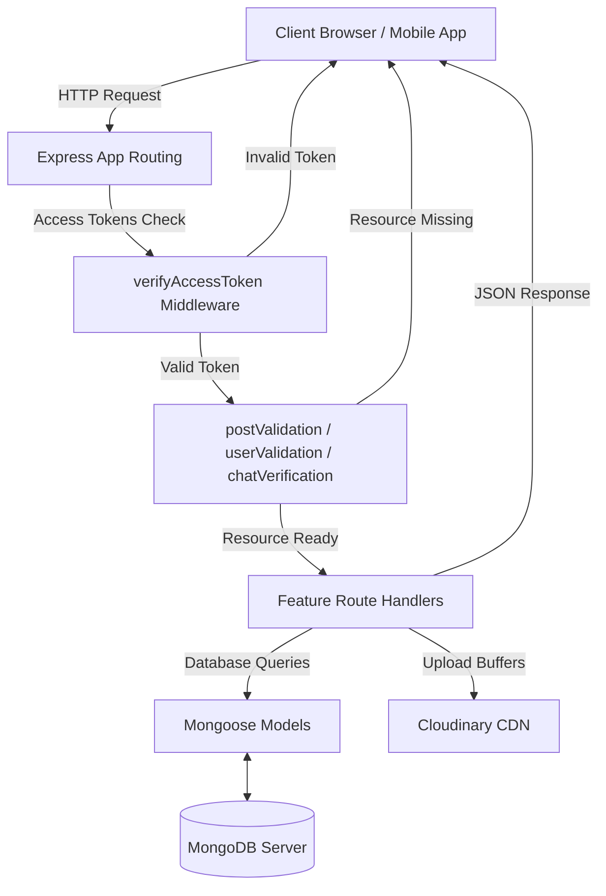
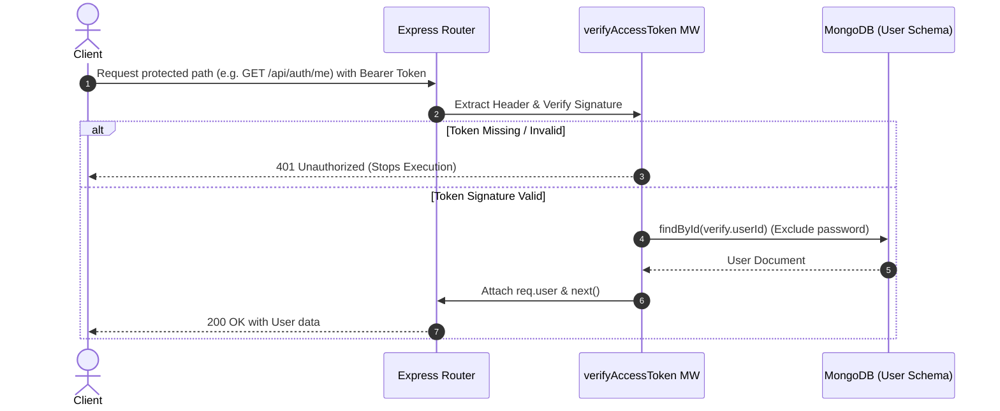
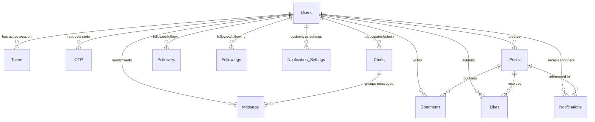

<<<<<<< HEAD
# 🎓 CampusPulse Backend

[](https://nodejs.org/)
[](https://expressjs.com/)
[](https://www.mongodb.com/)
[](https://github.com/websockets/ws)
[](https://cloudinary.com/)
[](https://jestjs.io/)
[](https://opensource.org/licenses/MIT)

CampusPulse is a high-performance, secure, and feature-rich social collaboration backend platform specifically tailored for college campus environments. It empowers students and faculty to interact in localized scopes, participate in real-time discussions, build peer networks, and communicate securely.

---

## 📌 Table of Contents

1. [Project Overview](#-project-overview)
2. [Problem Statement](#-problem-statement)
3. [Core Features](#-core-features)
4. [Tech Stack](#-tech-stack)
5. [System Architecture](#-system-architecture)
6. [Folder Structure Explanation](#-folder-structure-explanation)
7. [Installation Instructions](#-installation-instructions)
8. [Environment Variables](#-environment-variables)
9. [API Overview & Endpoints](#-api-overview--endpoints)
10. [Authentication Flow Summary](#-authentication-flow-summary)
11. [Database Overview & ERD](#-database-overview--erd)
12. [Testing Overview](#-testing-overview)
13. [Deployment Instructions](#-deployment-instructions)
14. [Technical Debt & Roadmap](#-technical-debt--roadmap)
15. [Contributing Guidelines](#-contributing-guidelines)

---

## 🔍 Project Overview

CampusPulse is engineered to serve as the core social backbone of a university ecosystem. Built with Express 5, Node.js, and MongoDB, the system supports highly scoped data isolation (e.g., college-wide, department-specific, or academic-year-specific feeds) to ensure that users only interact with content relevant to their academic standing and affiliation. The backend also incorporates real-time communications via the `ws` WebSocket package, transactional media uploading using Multer and Cloudinary, and granular notification preferences.

---

## ⚠️ Problem Statement

Modern college campus communication is severely fragmented. Students are forced to balance multiple unofficial platforms (like WhatsApp, Discord, or Telegram groups) alongside official university channels (such as LMS portals or emails). This leads to:
* **Notification Fatigue**: Crucial academic updates get lost in social chatter.
* **Lack of Privacy/Anonymity**: Students are often hesitant to voice concerns or ask academic questions due to public profile exposure.
* **Inefficient Peer Discovery**: Finding classmates within the same department or academic year requires manual networking.
* **Ineffective Moderation & Scoping**: Feeds are either too broad (everyone in college) or too narrow (individual group chats), with no middle ground.

### The CampusPulse Solution
CampusPulse provides a unified API designed around college taxonomy. By using strict database modeling of a student's `college`, `department`, and `academicYear`, the application automatically scopes post feeds and notifications. It allows anonymous discussions to foster open dialogue, while establishing secure direct and group messaging pipelines to streamline campus interactions.

---

## ✨ Core Features

* **🔐 JWT-based Authentication & Rotation**: Employs double-token auth architecture. Access tokens have a short lifespan (5 minutes), while refresh tokens (7-day lifespan) are hashed in the database via bcrypt and rotated to prevent session highjacking. Password recovery is supported using 6-digit OTPs dispatched via email.
* **📢 Scoped Post System**: Supports public and anonymous posting. Posts are tagged with visibility scopes:
  * `college`: Visible to the entire campus.
  * `department`: Restructured to a user's specific department (e.g., Computer Science).
  * `year`: Visible only to peers of the same academic year (e.g., 3rd-year students).
* **💬 Real-Time Messaging Engine**: Enables peer-to-peer Direct Messages (DMs) and admin-moderated Group Chats with live event synchronization over WebSockets, message read status tracking, and paginated message history.
* **👍 Polymorphic Interactions**: A modular like system allowing users to react to both posts and comments, along with multi-threaded comment nesting on posts.
* **🔔 Granular Notifications Engine**: Automatically dispatches alerts for likes, comments, follows, or mentions. Users can toggle notifications for specific activities or opt-in to system/email alerts.
* **☁️ Cloud Upload Pipeline**: Utilizes Multer memory buffers to pipe media assets directly to Cloudinary without writing temporary files to server disks, ensuring secure and fast uploads of profile photos, post attachments, and chat files.

---

## 🛠️ Tech Stack

| Technology | Category | Usage in CampusPulse |
| :--- | :--- | :--- |
| **Node.js** | Runtime | Core JavaScript runtime environment |
| **Express 5** | Web Framework | Request routing, HTTP handling, and middleware integration |
| **MongoDB & Mongoose** | Database | NoSQL document database and Object Document Mapper (ODM) |
| **WebSockets (ws)** | Real-Time | Bidirectional, low-latency client-backend connection |
| **Cloudinary** | Media CDN | Cloud-based media storage and delivery network |
| **Nodemailer** | E-mail Service | Automated dispatching of OTP codes for account recovery |
| **Bcrypt** | Security | Hashing credentials and refresh tokens |
| **Jest & Supertest** | Testing | Unit and integration testing framework |
| **mongodb-memory-server** | Dev-Ops | In-memory MongoDB utility for isolated, clean test environments |

---

## 🏗️ System Architecture

CampusPulse uses a **Layered MVC Architecture (Model-Route-Middleware)** design. It operates as a stateless monolith with unified REST routing and connection upgrading hooks for real-time WebSocket traffic.

### Architecture Flow



### Layer Definitions

1. **Client Layer**: Manages the UI state, stores ephemeral access tokens in memory, and keeps a connection open to `ws://localhost:3000?token=access_token`.
2. **API/Routing Layer (`/api`)**: Listens on the primary port, parses incoming payloads, and maps HTTP requests to feature-specific route controllers.
3. **Middleware Layer**: Standardizes access policies. Intercepts incoming requests to evaluate JWT signatures (`verifyAccessToken`) and load query targets into memory (`postValidation`, `userValidation`, `chatVerification`).
4. **Business Logic Layer**: Houses transaction processing, password hashing, and third-party dispatches (Cloudinary, Nodemailer).
5. **Persistence Layer**: Enforces schema rules and handles database queries/relationships through Mongoose ODM to MongoDB.

---

## 📂 Folder Structure Explanation

```text
campuspulse-backend/
├── app.js                            # Express app wrapper: registers middlewares & routes
├── server.js                         # Application entrypoint: mounts database and starts HTTP server
├── index.html                        # Sandbox client page for WebSocket validation
├── database/                         # Database layer
│   ├── mongoDB.js                    # MongoDB connection initialization wrapper
│   └── schema/                       # Mongoose model definitions
│       ├── authSchema/               # User, session tokens, and OTP credentials
│       ├── chatSchema/               # Direct and group chat configurations and message schemas
│       ├── followSchema/             # Graph schemas mapping follower/following lines
│       ├── notificationSchema/       # Notification logs and user preferences configurations
│       └── postsSchema/              # Posts, comments, and polymorphic likes schemas
├── middlewares/                      # Intermediary request validations & security guards
│   ├── chatsMiddleware/              # Chat room validation filters
│   ├── postValidation.js             # Verifies post existence by postId
│   ├── userValidation.js             # Verifies target profile existence by userId
│   ├── verifyAccessToken.js          # Authenticates JWT access tokens
│   └── verifyRefreshToken.js         # Authenticates JWT refresh tokens
├── routes/                           # Main route controllers (REST Endpoints)
│   ├── auth/                         # Authentication, logout, and password recovery
│   ├── chats/                        # CRUD operations for groups, DMs, and message history
│   ├── notifications/                # Triggers, preference edits, and clear logs
│   ├── posts/                        # Publishing, commenting, and polymorphic liking
│   ├── upload/                       # Cloudinary upload endpoints
│   └── users/                        # User search, profiling, and follower updates
├── webSockets/                       # Real-time WebSocket connection module
│   ├── setupWebSocket.js             # WS Server instantiation & socket validation
│   ├── handler/                      # Inbound websocket event processors
│   └── middlewares/                  # Connection level token check middleware
└── tests/                            # Automation test suites (Jest & Supertest)
```

---

## 🚀 Installation Instructions

### Prerequisites
* **Node.js**: `v18.x` or higher
* **MongoDB**: Standard local installation or a MongoDB Atlas cloud URI
* **Cloudinary**: Free tier account for API keys

### Setup Steps
1. **Clone the Repository**
   ```bash
   git clone https://github.com/your-username/campuspulse-backend.git
   cd campuspulse-backend
   ```

2. **Install Dependencies**
   ```bash
   npm install
   ```

3. **Configure Environment Variables**
   Create a `.env` file in the root directory (see the [Environment Variables](#-environment-variables) section below for template values).

4. **Run the Application**
   * **Development Mode** (with Nodemon hot-reloading):
     ```bash
     npm run dev
     ```
   * **Production Mode**:
     ```bash
     npm start
     ```

---

## 🔒 Environment Variables

Create a `.env` file in the root of the workspace. Fill in the values as detailed below:

| Variable | Purpose | Required | Example |
| :--- | :--- | :--- | :--- |
| `PORT` | Listening port for Express | No (Defaults to 3000) | `3000` |
| `MONGODB_URL` | MongoDB Connection String URI | **Yes** | `mongodb://localhost:27017/campuspulse` |
| `JWT_ACCESS` | Secret key used to sign access tokens | **Yes** | `super_secure_access_secret_123!` |
| `JWT_REFRESH` | Secret key used to sign refresh tokens | **Yes** | `super_secure_refresh_secret_456!` |
| `JWT_SECRET` | Secret key fallback for reset token signatures | **Yes** | `auth_fallback_secret_key` |
| `JWT_ACEESS` | Typo key used inside password reset signatures | **Yes** *(Temporary fix for legacy reset route compatibility)* | `access_fallback_secret_key` |
| `CLOUDINARY_CLOUD_NAME` | Cloudinary storage bucket namespace | **Yes** | `dnqkk0xg3` |
| `CLOUDINARY_API_KEY` | Public key credential for Cloudinary API | **Yes** | `163983731939733` |
| `CLOUDINARY_API_SECRET` | Secret key credential for Cloudinary API | **Yes** | `PdCuWZn6E3lMWlSYxPJY8cCoUsU` |
| `SMTP_HOST` | Host address of SMTP mail server | No | `smtp.ethereal.email` |
| `SMTP_PORT` | Port of SMTP server | No | `587` |
| `SMTP_SECURE` | Connect via SSL/TLS check | No | `false` |
| `SMTP_USER` | Username account for SMTP auth | No | `testuser@ethereal.email` |
| `SMTP_PASS` | Password account for SMTP auth | No | `user_password` |
| `SMTP_FROM` | Outbound sender format header | No | `"CampusPulse" <no-reply@campuspulse.edu>` |

---

## 🔌 API Overview & Endpoints

All endpoints default to the prefix `/api`. Protected routes require a valid JSON Web Token passed as a bearer token in the HTTP Authorization header: `Authorization: Bearer <access_token>`.

### 1. Authentication (`/api/auth/*`)
| Method | Endpoint | Description | Auth Required |
| :---: | :--- | :--- | :---: |
| **POST** | `/auth/register` | Sign up a new user account | No |
| **POST** | `/auth/login` | Validate credentials and return tokens | No |
| **POST** | `/auth/logout` | Revoke user refresh token session | **Yes** |
| **GET** | `/auth/me` | Retrieve the logged-in user profile details | **Yes** |
| **PUT** | `/auth/me` | Edit active user profile fields | **Yes** |
| **POST** | `/auth/forgot-password` | Generate OTP (Step 1) / Verify & update password (Step 2) | No |
| **POST** | `/auth/reset-password` | Initiates password reset flow with OTP verification | No |
| **POST** | `/auth/refresh` | Rotate access token using a valid refresh token | **Yes** *(Refresh)* |
| **GET** | `/auth/verify` | Confirm validation status of the access token | **Yes** |

### 2. User & Relationships (`/api/users/*`)
| Method | Endpoint | Description | Auth Required |
| :---: | :--- | :--- | :---: |
| **GET** | `/users/search` | Search for users by college, department, year, name | **Yes** |
| **GET** | `/users/:userId` | Get profile metadata (hides email for other users) | **Yes** |
| **PUT** | `/users/me` | Edit user profile metrics | **Yes** |
| **POST** | `/users/:userId/follow` | Start following a user | **Yes** |
| **DELETE** | `/users/:userId/follow` | Unfollow a user | **Yes** |
| **GET** | `/users/:userId/followers` | Fetch paginated followers list | **Yes** |
| **GET** | `/user/:userId/following` | Fetch paginated list of followed users | **Yes** |
| **GET** | `/users/:userId/is-following`| Verify if logged-in user is following target user | **Yes** |

### 3. Forums & Posts (`/api/posts/*`)
| Method | Endpoint | Description | Auth Required |
| :---: | :--- | :--- | :---: |
| **GET** | `/posts` | Paginated feed with scope, dept, and year filters | **Yes** |
| **POST** | `/posts` | Publish a new post (supports anonymous toggling) | **Yes** |
| **GET** | `/posts/:postId` | Retrieve details of a specific post | **Yes** |
| **PUT** | `/posts/:postId` | Update post content (requires author ownership) | **Yes** |
| **DELETE** | `/posts/:postId` | Delete a post (requires author ownership) | **Yes** |
| **POST** | `/posts/:postId/like` | Like a post (polymorphic entry) | **Yes** |
| **DELETE** | `/posts/:postId/like` | Unlike a post | **Yes** |
| **GET** | `/posts/:postId/comments` | Retrieve comments under a specific post | **Yes** |
| **POST** | `/posts/:postId/comments` | Add a comment to a post | **Yes** |
| **DELETE** | `/posts/:postId/comments/:commentId` | Delete comment (requires author check) | **Yes** |

### 4. Messaging & Chats (`/api/chats/*`)
| Method | Endpoint | Description | Auth Required |
| :---: | :--- | :--- | :---: |
| **GET** | `/chats` | Get all DM and group rooms for the active user | **Yes** |
| **GET** | `/chats/:chatId` | Get metadata for a specific chat room | **Yes** |
| **GET** | `/chats/:chatId/messages` | Get paginated message history | **Yes** |
| **POST** | `/chats/group` | Create a new group chat room | **Yes** |
| **POST** | `/chats/dm/messages/:userId`| Send DM message (creates room dynamically if needed) | **Yes** |
| **POST** | `/chats/:chatId/messages`| Send message in group chat room | **Yes** |
| **POST** | `/chats/:chatId/messages/:messageId/read`| Add user to message readBy registry | **Yes** |
| **POST** | `/chats/:chatId/members` | Add participants to group chat (admin only) | **Yes** |
| **POST** | `/chats/:chatId/leave` | Exit group chat room | **Yes** |
| **DELETE** | `/chats/:chatId/messages/:messageId`| Delete a user's sent message | **Yes** |
| **DELETE** | `/chats/:chatId/members/:userId`| Remove a user from group chat (admin only) | **Yes** |

### 5. Notifications (`/api/notifications/*`)
| Method | Endpoint | Description | Auth Required |
| :---: | :--- | :--- | :---: |
| **GET** | `/notifications` | Retrieve notifications list | **Yes** |
| **GET** | `/notifications/unread-count`| Get count of active unread alerts | **Yes** |
| **PUT** | `/notifications/:notificationId/read`| Toggle single notification read status | **Yes** |
| **PUT** | `/notifications/read-all`| Mark all active notifications as read | **Yes** |
| **DELETE** | `/notifications/:notificationId`| Remove single notification record | **Yes** |
| **DELETE** | `/notifications/clear-read`| Remove all read notification records | **Yes** |
| **GET** | `/notifications/settings`| Fetch user's notification toggles | **Yes** |
| **PUT** | `/notifications/settings`| Update notification preferences | **Yes** |

### 6. File Uploads (`/api/uploads/*`)
| Method | Endpoint | Description | Auth Required |
| :---: | :--- | :--- | :---: |
| **POST** | `/uploads/chat-image` | Upload image for chat attachment | **Yes** |
| **POST** | `/uploads/image` | Upload up to 5 images for posts | **Yes** |
| **POST** | `/uploads/profile-photo`| Upload profile photo and update user profile | **Yes** |

---

## 🔄 Authentication Flow Summary

CampusPulse leverages double-token JWT access control for stateless performance combined with session invalidation capabilities.

### Sequence Diagram: Access Validation Lifecycle



### The Rotation Strategy
1. **Login/Registration**: The client authenticates successfully. The server issues an `accessToken` (signed with `JWT_ACCESS`, valid for 5 minutes) and a `refreshToken` (signed with `JWT_REFRESH`, valid for 7 days).
2. **Session Rotation**: The server stores a bcrypt hash of the active refresh token in the `Token` collection. When the access token expires, the client calls `/api/auth/refresh` sending the refresh token. The server decodes it, matches its bcrypt signature against the database, and issues a new access token.
3. **Session Termination**: Calling `/api/auth/logout` sets `isRevoked: true` on the refresh token document in the database, invalidating the session.

---

## 🗄️ Database Overview & ERD

The backend utilizes **MongoDB** structured through **Mongoose** modeling. Relational cascades are controlled at the application layer.

### Entity Relationship Diagram (ERD)



### Collection Contracts & Indexes
* **Users (`Users`)**: Uniquely indexes `userName` and `email`. Enforces strict email format verification.
* **Tokens (`tokens`)**: Manages session records. Uniquely references `userId` and provides automatic session expiration matching token lifespans.
* **OTPs (`otps`)**: Temporarily stores hashed password-recovery passcodes with a `120s` TTL index for automatic security cleanups.
* **Notifications (`notifications`)**: Compounds indexes `{ recipient: 1, createdAt: -1 }` for rapid feed lookups.

---

## 🧪 Testing Overview

The codebase implements testing using **Jest** and **Supertest** to mock API calls. It relies on **mongodb-memory-server** to run testing workflows in isolation without affecting developers' local databases.

### Execution Commands
* **Run Test Suite**:
  ```bash
  npm run test
  ```
* **Generate Coverage Reports**:
  ```bash
  npm run test:coverage
  ```

---

## ☁️ Deployment Instructions

### Steps for Deployment (Render / Railway / AWS)
1. **Database Setup**: Deploy a managed MongoDB cluster (e.g., MongoDB Atlas). Obtain the database connection URI.
2. **Cloudinary setup**: Register a Cloudinary account, copy API credentials (cloud name, API key, API secret).
3. **Environment Setup**: Add all the keys in the [Environment Variables](#-environment-variables) table to the platform's Environment Settings dashboard. Do not commit your `.env` file to production repositories.
4. **Deploy Command**: 
   * Build command: `npm install`
   * Start command: `node server.js`
5. **WebSocket Support**: Ensure your deployment platform supports WebSocket protocol upgrades (e.g. Render Web Services, AWS EC2, or Railway App services). Platforms serving only serverless functions (like Vercel) will not maintain permanent WebSockets connections.

---

## 📍 Technical Debt & Roadmap

During our audit, we documented the following items to address in the upcoming development phases.

### Development Roadmap

```
                  +----------------------------------------------+
                  |              DEVELOPMENT ROADMAP             |
                  +----------------------+-----------------------+
                                         |
            Critical / High Priority     |     Medium / Low Priority
        +---------------------------------+----------------------------------+
        | - Fix security vulnerabilities  | - Implement push alerts          |
        | - Fix password reset typos      | - Clean up search performance    |
        | - Sync follower graphs          | - Standardize API responses      |
        | - Connect WebSockets            | - Write missing unit tests       |
        +---------------------------------+----------------------------------+
```

### High Priority & Critical Security Fixes
* **🚨 Notification IDOR Vulnerabilities**:
  * *Location*: `DELETE /api/notifications/:notificationId` and `PUT /api/notifications/:notificationId/read`.
  * *Issue*: Resource queries do not match against the logged-in user's identity. Any authenticated user can mutate or delete another user's notifications.
* **🚨 Password Reset Signatures Typo**:
  * *Location*: [resetPassword.js](file:///d:/web-dev/Ai/campuspulse%20backend/routes/auth/resetPassword.js).
  * *Issue*: Reset tokens are signed using the typo environment key `process.env.JWT_ACEESS` but validated using `process.env.JWT_ACCESS`, causing runtime verification failures.
* **📊 Follower Graph Synchronization**:
  * *Location*: `/api/users/:userId/follow` (POST/DELETE).
  * *Issue*: Follow actions only write to the `Following` collection, leaving the `Follower` records out of sync.
* **🔌 WebSocket Server Hook**:
  * *Location*: [server.js](file:///d:/web-dev/Ai/campuspulse%20backend/server.js).
  * *Issue*: Connect the WebSocket server listener to the HTTP server instance.

---

## 🤝 Contributing Guidelines

We welcome contributions to CampusPulse! To maintain coding quality and consistency, all pull requests must follow these rules:

### Naming Conventions
* **Mongoose Models**: Use PascalCase (e.g., `userModel`). Filenames must follow camelCase with schema suffixes (e.g., `userSchema.js`).
* **Route Files**: camelCase naming with route suffixes (e.g., `registrationRoute.js`, `postsGetsRoute.js`).
* **Variables**: Standard camelCase.
* **Environment Variables**: Strict UPPER_CASE layout.

### Code Constraints
1. **Explicit local ES imports**: The repository uses ES modules. You **must** specify the file extension on all local file imports (e.g. `import app from "./app.js"`).
2. **Object ID Validation**: Always validate request parameter IDs using `mongoose.Types.ObjectId.isValid` before querying the database.
3. **Database Cascade Deletion**: Make sure all related records are deleted when a primary record is removed (e.g., deleting a post must delete associated comments and likes).
4. **Standard Response Formatting**: Always structure responses using the standard wrapper format:
   ```json
   {
     "success": true,
     "message": "Descriptive message",
     "data": {}
   }
   ```
=======
# CampusPulse

> A backend powering a campus-exclusive social networking platform built to help college students connect, collaborate, and build meaningful relationships within their campus community.


---

# What is CampusPulse?

College life is much more than attending lectures and submitting assignments. It is about meeting new people, collaborating on ideas, discovering opportunities, and becoming part of a community.

However, in many colleges, students often interact only with classmates from their own department or friend circle. Finding students with similar interests, connecting with seniors, or discovering people from other branches can be surprisingly difficult.

Existing platforms such as LinkedIn are excellent for professional networking, but they are designed for the global workforce—not for everyday interactions within a college campus. They are often too broad and crowded to support a close-knit campus community.

**CampusPulse** aims to solve this problem by providing a dedicated social platform exclusively for college students.

It creates a digital campus where students can:

- Connect with peers across different departments
- Share updates and campus moments
- Follow students with similar interests
- Build meaningful campus relationships
- Discover people beyond their classroom
- Create a stronger sense of community within the college

CampusPulse brings the familiarity of a social media platform while keeping the experience focused on a single college ecosystem.

---

# About this Repository

This repository contains the **backend server** for CampusPulse.

It provides secure authentication, user management, post management, social interactions, media uploads, notifications, and REST APIs that power the frontend application.

The project follows a modular architecture to keep features organized and maintainable as the platform grows.

---

# Features

## Authentication

- JWT Access & Refresh Token Authentication
- Email OTP Verification
- Secure Password Hashing
- Password Reset
- Protected Routes
- Authentication Middleware

## User Management

- User Registration
- Login & Logout
- Profile Management
- User Search
- Profile Picture Upload
- Follow / Unfollow Users

## Social Features

- Create Posts
- Edit Posts
- Delete Posts
- Like Posts
- Comment on Posts
- Personalized Feed

## Notifications

- User Notifications
- Notification Preferences

## Media Uploads

- Profile Images
- Post Images
- Cloudinary Integration

## Security

- JWT Authorization
- Password Encryption
- Request Validation
- Environment Variable Configuration

---

# Tech Stack

- Node.js
- Express.js
- MongoDB
- Mongoose
- JWT
- bcrypt
- Multer
- Cloudinary
- Nodemailer
- Jest
- Supertest

---

# Project Structure

```
CampusPulse/
│
├── database/
│   ├── mongoDB.js
│   └── schema/
│
├── routes/
│   ├── auth/
│   ├── users/
│   ├── posts/
│   ├── chats/
│   ├── notifications/
│   └── upload/
│
├── middlewares/
│
├── tests/
│
├── app.js
├── server.js
└── package.json
```

---

# Getting Started

## Prerequisites

Before running the project, ensure you have:

- Node.js (v18+)
- MongoDB
- Cloudinary Account (for media uploads)

---

# Installation

Clone the repository

```bash
git clone https://github.com/your-username/CampusPulse.git
```

Navigate into the project

```bash
cd CampusPulse
```

Install dependencies

```bash
npm install
```

---

# Environment Variables

Create a `.env` file in the project root.

```env
PORT=3000

MONGODB_URI=your_mongodb_uri

JWT_ACCESS_SECRET=your_access_secret
JWT_REFRESH_SECRET=your_refresh_secret

CLOUDINARY_CLOUD_NAME=your_cloud_name
CLOUDINARY_API_KEY=your_api_key
CLOUDINARY_API_SECRET=your_api_secret
```

---

# Running the Server

```bash
npm start
```

The backend will start at:

```
http://localhost:3000
```

---

# API Modules

The backend APIs are organized by feature.

### Authentication

- Register
- Login
- Verify OTP
- Refresh Token
- Logout
- Forgot Password
- Reset Password

### Users

- User Profile
- Update Profile
- Search Users
- Delete Account
- Follow / Unfollow

### Posts

- Create Post
- Update Post
- Delete Post
- Like
- Comment
- Feed

### Chats

- Create Chat
- Manage Conversations
- Send Messages

### Notifications

- Get Notifications
- Update Notification Settings

### Uploads

- Upload Profile Picture
- Upload Post Images

---

# Testing

The project includes a comprehensive automated testing suite using **Jest** and **Supertest**.

Tests cover:

- Authentication
- Users
- Posts
- Comments
- Likes
- Chats
- Uploads
- Middleware
- Security

Run tests with:

```bash
npm test
```

---

# Future Roadmap

- Real-time messaging
- Event management
- Clubs & Communities
- College Marketplace
- Story Sharing
- Campus Announcements
- API Documentation (Swagger)
- Docker Support
- CI/CD Pipeline

---

# Contributing

Contributions are always welcome.

1. Fork the repository.
2. Create a new feature branch.
3. Commit your changes.
4. Push your branch.
5. Open a Pull Request.

---

# License

This project is licensed under the MIT License.

---

# Author

Developed with ❤️ by **Gautam Vishwakarma**
>>>>>>> 6b36237cb7f21b54dd20fc2d8b047bffb103544d
